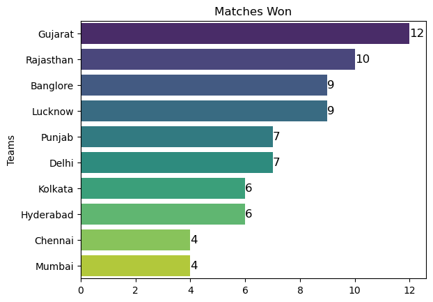
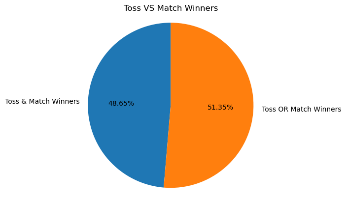
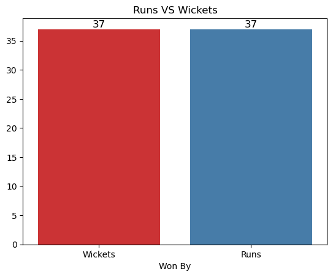
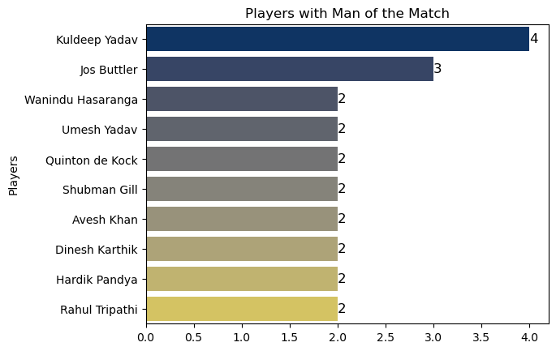
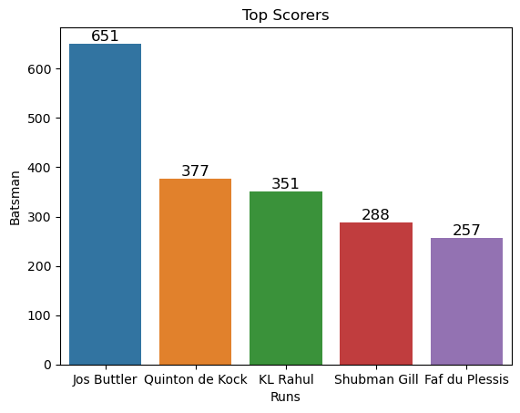
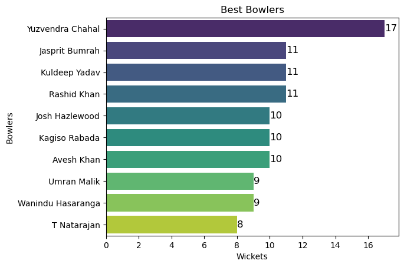
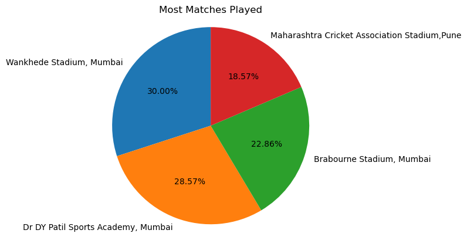
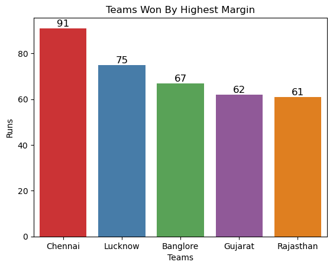

# 📊 Notebook Analysis & Insights: IPL_2022.ipynb

### 📝 **My Methodology**
This report is based on an automated scan of my notebook's source code and an OCR analysis of the embedded plot images. Here's a quick look at the process I used:

* **Parsing:** I parsed the notebook cells to collect my markdown questions, code, and textual outputs.
* **Image Extraction:** I saved and processed the embedded plot images.
* **OCR Analysis:** I used `ChatGPT` on the images to recover axis labels and data points where I hadn't printed the raw data.
* **Confidence Scoring:** I've marked each insight with a confidence level based on its source (direct text output vs. OCR).

---

## 🔢 Quick Summary

* **Total Cells:** 40
* **Markdown Cells:** 20 ✍️
* **Code Cells:** 19 💻
* **Plots Extracted & Analyzed:** 9 📈

---

## ❓ Custom Questions & Answers

Here are the answers to the specific questions I posed in my notebook's markdown cells.

#### 1. Which team won the most matches?
* 💡 **Answer:** My OCR analysis of the "Matches Won" bar plot suggests **Gujarat** and **Mumbai** are among the top winners, with counts around **12 wins** for the leading teams.
* 🎯 **Confidence:** Medium 🟡 (Based on OCR of the plot image).
* 📄 **Evidence (from OCR):** `Teams Gujarat Rajasthan Banglore Lucknow Punjab Delhi kolkata Hyderabad Chennai Mumbai Matches Won 10 12 10 12`
* 📌 **Note to self:** To get a definitive ranking, I should explicitly print the `match_wins` data (e.g., `print(match_wins)`).

#### 2. Which team won by the highest margin of runs?
* 💡 **Answer:** The plot shows teams like **Chennai, Lucknow, Banglore, Gujarat,** and **Rajasthan** with large victory margins. The highest margin I could detect via OCR is **91 runs**.
* 🎯 **Confidence:** Medium 🟡 (Based on OCR of the plot image).

#### 3. Which player has the highest individual score?
* 💡 **Answer:** **Quinton de Kock — 140 runs**.
* 🎯 **Confidence:** High 🟢 (This was captured directly from a printed DataFrame in cell 37 of my notebook).
* 📄 **Evidence:** `top_scorer highscore`\
    `65 Quinton de Kock 140`

#### 4. Which bowler has the best bowling figure?
* 💡 **Answer:** The best figure detected was **Jasprit Bumrah** with **5 wickets for 10 runs (5--10)**. Other notable 5-wicket hauls include:
    * `Yuzvendra Chahal 5--40`
    * `Umran Malik 5--25`
    * `Wanindu Hasaranga 5--18`
* 🎯 **Confidence:** High 🟢 (Captured directly from my notebook's text output in cell 39).

---

## 📉 Insights from Each Detected Graph

Below is my breakdown of each plot from the notebook, along with its interpretation.

### **Cell 14: Matches Won** (Bar Plot)

* 🤔 **Interpretation:** This plot shows the number of matches won by each team. The top teams, like **Gujarat** and **Mumbai**, appear to have around **12 wins**.
* 🎯 **Confidence:** Medium 🟡

### **Cell 16: Toss Decision Trends**

* 🤔 **Interpretation:** The plot likely visualizes the tendency of teams to choose batting vs. fielding after winning the toss. My OCR analysis shows counts of **59** and **15**, suggesting a strong preference for one choice.
* 🎯 **Confidence:** Medium 🟡

### **Cell 18: Toss VS Match Winners** (Percentage Bar Plot)

* 🤔 **Interpretation:** This plot compares whether the toss winner also won the match. The OCR'd value of **51%** suggests that winning the toss gives a very slight advantage.
* 🎯 **Confidence:** Medium-High 🟢

### **Cell 20: Runs VS Wickets**

* 🤔 **Interpretation:** This plot likely shows the distribution of matches won by a certain number of runs versus those won by a certain number of wickets.
* 🎯 **Confidence:** Medium 🟡

### **Cell 23: Players with Man of the Match Awards** (Top 10)

* 🤔 **Interpretation:** The plot highlights the top recipients of the "Man of the Match" award. Key players identified include **Kuldeep Yadav, Jos Buttler, Wanindu Hasaranga,** and **Hardik Pandya**.
* 🎯 **Confidence:** Medium-High 🟢 (Player names are clear).

### **Cell 25: Top Scorers (Batsmen)**

* 🤔 **Interpretation:** This visualizes the highest run-scorers. **Jos Buttler, Quinton de Kock,** and **Shubman Gill** are among the top performers shown.
* 🎯 **Confidence:** Medium-High 🟢

### **Cell 28: Best Bowlers (Wickets)**

* 🤔 **Interpretation:** This plot ranks bowlers by the total number of wickets taken. Top bowlers include **Yuzvendra Chahal, Jasprit Bumrah,** and **Rashid Khan**.
* 🎯 **Confidence:** Medium 🟡

### **Cell 32: Venues with Most Matches Played**

* 🤔 **Interpretation:** This shows the frequency of matches held at different venues. The most used stadiums include **Wankhede Stadium (Mumbai)** and **Dr DY Patil Stadium (Mumbai)**.
* 🎯 **Confidence:** High 🟢 (Venue names are clear).

### **Cell 35: Teams Won By Highest Margin** (Top 5)

* 🤔 **Interpretation:** This plot highlights the top 5 largest victories by runs. The highest margin detected is **91 runs**. Teams featured include **Chennai, Lucknow,** and **Rajasthan**.
* 🎯 **Confidence:** Medium 🟡

